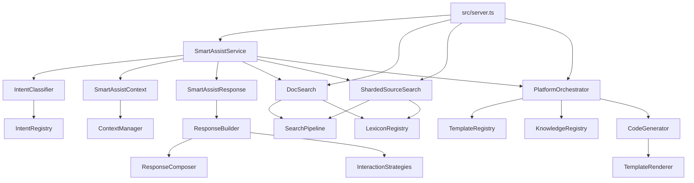
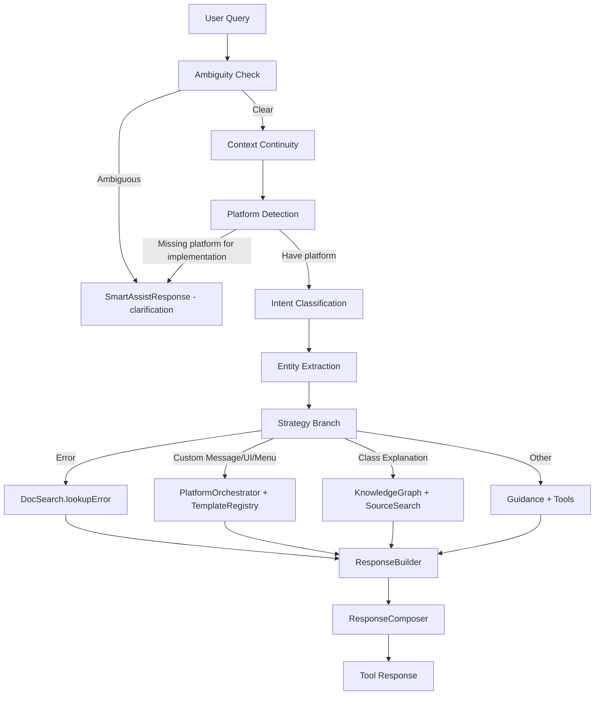

# EM Integration Assistant Architecture

## Overview
This repository hosts the MCP server that provides documentation search, source search, code templates, and smart-assist orchestration for the EaseIM SDK ecosystem. The MCP server is the primary focus of this document.

Key goals:
- Provide unified access to SDK docs, UIKit source, error codes, and integration guidance
- Support multi-platform material injection (docs, sources, templates, knowledge)
- Keep the orchestration layer thin and delegate to dedicated services

## Module Map

### Entry and Orchestration
- `src/server.ts` — MCP server entry, tool routing, and light orchestration
- `src/assist/SmartAssistService.ts` — smart assist business flow and decisioning
- `src/assist/SmartAssistContext.ts` — context continuity and recommendations
- `src/assist/SmartAssistResponse.ts` — smart assist response composition

### Intelligence / Registries
- `src/intelligence/IntentClassifier.ts` — intent classification and entity extraction
- `src/intelligence/IntentRegistry.ts` — intent patterns/semantics and entity rules
- `src/intelligence/TemplateRegistry.ts` — template index for multi-platform code templates
- `src/intelligence/KnowledgeRegistry.ts` — scenario knowledge and steps per platform
- `src/intelligence/ClassRegistry.ts` — class metadata and inheritance indexing
- `src/intelligence/LexiconRegistry.ts` — lexicon data per platform
- `src/intelligence/PlatformOrchestrator.ts` — platform routing for scenarios/templates
- `src/intelligence/TemplateRenderer.ts` — template rendering and variable fill
- `src/intelligence/CodeGenerator.ts` — template selection and generation

### Search
- `src/search/SearchPipeline.ts` — shared query preparation, corrections, expansions
- `src/search/DocSearch.ts` — documentation search + error lookup
- `src/search/ShardedSourceSearch.ts` — source search with shard loading
- `src/search/SourceSearch.ts` — non-sharded source search (legacy/utility)

### Response Composition
- `src/utils/ResponseBuilder.ts` — response building with interactions
- `src/utils/ResponseComposer.ts` — interaction section + metadata composition
- `src/utils/InteractionStrategies.ts` — reusable interaction hints

### Data / Materials
- `data/docs/*` — SDK documentation index and modules
- `data/sources/*` — UIKit source shards and index
- `data/templates/*` — template index and shards
- `data/knowledge/*` — scenario knowledge shards
- `data/classes/*` — class metadata shards
- `data/lexicon/*` — lexicon (synonyms/abbr/stopwords) per platform
- `data/intents/*` — intent patterns and rules

### Scripts
- `scripts/*` — shard generation and indexing utilities

## Code Architecture Diagram

## Business Logic Flow Diagram (Smart Assist)

## Data/Material Pipelines

### Template Pipeline
- Source: `data/templates/index.json`
- Shards: `data/templates/shards/*.json`
- Consumers: `TemplateRegistry`, `PlatformOrchestrator`, `CodeGenerator`, `TemplateRenderer`

### Knowledge Pipeline
- Source: `data/knowledge/index.json`
- Shards: `data/knowledge/shards/*.json`
- Consumers: `KnowledgeRegistry`, `PlatformOrchestrator`, `SmartAssistService`

### Class Pipeline
- Source: `data/classes/index.json`
- Shards: `data/classes/shards/*.json`
- Consumers: `ClassRegistry`, `KnowledgeGraph`

### Source Pipeline
- Source: `data/sources/index.json`
- Shards: `data/sources/shards/*.json`
- Consumers: `ShardedSourceSearch`, `SourceSearch`

### Intent/Lexicon Pipeline
- Source: `data/intents/index.json`, `data/lexicon/index.json`
- Consumers: `IntentRegistry`, `IntentClassifier`, `QueryExpander`, `SpellCorrector`, `SearchSuggester`

## Extension Points
- Platform materials: add to `data/docs`, `data/sources`, `data/templates`, `data/knowledge`, `data/classes`
- Templates: add in `data/templates/index.json` and regenerate shards
- Scenarios: add in `data/knowledge/index.json` and regenerate shards
- Intent patterns: update `data/intents/index.json`
- Lexicon terms: update `data/lexicon/index.json`

## Build/Verification
- `npm run build` — TypeScript compile
- `npm run generate-template-shards` — template shards
- `npm run generate-lexicon-shards` — lexicon shards
- `npm run generate-integration-shards` — integration shards

## Notes on Coupling
- `server.ts` should remain a thin router; services handle business logic.
- `ResponseBuilder` is now a composer facade; strategy logic lives in `InteractionStrategies`.
- `SearchPipeline` centralizes query enhancement to keep searches consistent across domains.
