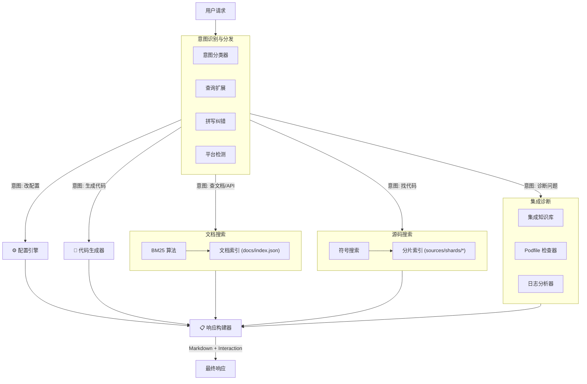

# EaseIM MCP Server 架构与工具详解

本文档详细介绍了 EaseIM MCP Server 的工具列表、使用方法、内部运行逻辑以及整体系统架构。

---

## 1. 整体架构逻辑

系统采用 **Intent-Driven Architecture (意图驱动架构)**，所有的用户请求首先经过意图识别层，然后根据识别结果路由到具体的搜索引擎或诊断模块，最终由响应构建器组装成标准化回复。



---

## 2. 工具列表与使用详解

### 2.1 基础查询类

#### `search_api` (搜索 API 文档)
*   **用途**: 查找 SDK 的接口文档、方法说明。
*   **参数**: 
    *   `query`: 搜索关键词 (如 "sendMessage", "login")
    *   `platform` (可选): "ios" | "android" | ...
*   **运行逻辑**:
    ```mermaid
    graph LR
        Query --> SpellCorrector --> QueryExpander --> BM25Search --> AmbiguityCheck --> Result
    ```
*   **输出**: 相关 API 列表，包含简述、所属模块和文档链接。

#### `search_source` (搜索源码)
*   **用途**: 查找 UIKit 的源码实现，定位类定义或方法逻辑。
*   **参数**:
    *   `query`: 符号名或功能词 (如 "CustomMessageCell", "bubble color")
    *   `component` (可选): "EaseChatUIKit" 等
*   **运行逻辑**:
    ```mermaid
    graph LR
        Query --> ShardLoader[加载分片索引] --> SymbolMatcher[符号匹配] --> ContextPreview --> Result
    ```
*   **输出**: 匹配的代码文件路径、行号以及符号定义。

#### `lookup_error` (查询错误码)
*   **用途**: 根据错误码数字查找含义和解决方案。
*   **参数**: `code` (数字, 如 508)
*   **输出**: 错误名称、详细原因分析、解决方案步骤。

#### `read_doc` / `read_source` (读取内容)
*   **用途**: 读取具体的 Markdown 文档内容或源码文件内容。
*   **参数**: `path` (文件路径)
*   **输出**: 文件的完整文本内容。

---

### 2.2 智能化辅助类

#### `smart_assist` (智能助手)
*   **用途**: **推荐入口**。处理自然语言请求，自动分析意图并调用其他工具。
*   **参数**: `query` (自然语言, 如 "我想自定义订单消息")
*   **运行逻辑**:
    ```mermaid
    graph TD
        Input --> ContextCheck[上下文检测]
        ContextCheck --> IntentClassify[意图分类]
        IntentClassify --> |意图: 实现功能| KnowledgeGraph[知识图谱]
        IntentClassify --> |意图: 修复错误| ErrorDB[错误库]
        KnowledgeGraph --> CodeGen[代码生成]
        ErrorDB --> Solution[解决方案]
        CodeGen --> Response
        Solution --> Response
    ```
*   **输出**: 综合性的回答，可能包含代码片段、步骤说明或进一步的交互选项。

#### `generate_code` (代码生成)
*   **用途**: 生成特定场景的完整代码模板。
*   **参数**: 
    *   `scenario`: 场景 ID (如 "custom_message")
    *   `name`: 自定义名称
*   **输出**: 可直接运行的 Swift/Kotlin 代码块。

#### `explain_class` (类解释)
*   **用途**: 解释某个类的作用、继承关系和使用方法。
*   **参数**: `className`
*   **输出**: 类的职责描述、父类、关键属性/方法列表及使用示例。

---

### 2.3 配置与扩展类

#### `list_config_options` (列出配置)
*   **用途**: 查看 UI 组件的可配置属性（Appearance）。
*   **参数**: `component` (可选)
*   **输出**: 配置项列表（如 `avatarRadius`, `primaryHue`），包含类型和默认值。

#### `get_extension_points` (获取扩展点)
*   **用途**: 查看可以继承的类或实现的协议。
*   **参数**: `component` (可选)
*   **输出**: Open Class 和 Protocol 列表。

---

### 2.4 集成诊断类

#### `check_integration` (检查集成)
*   **用途**: 检查 Podfile 或环境配置是否正确。
*   **参数**: `podfileContent` (文件内容)
*   **运行逻辑**:
    ```mermaid
    graph LR
        Content --> Parser[解析器] --> RuleEngine[规则引擎] --> Report[诊断报告]
    ```
*   **输出**: 检查报告，列出错误（如版本过低）和警告。

#### `diagnose_build_error` (诊断构建错误)
*   **用途**: 根据报错日志分析原因。
*   **参数**: `errorMessage` (报错文本)
*   **输出**: 错误原因分析（如 "Sandbox 权限被拒绝"）及修复命令。

#### `get_podfile_template` (获取模板)
*   **用途**: 获取标准的 Podfile 模板。
*   **输出**: 包含推荐配置（如 `post_install` 脚本）的 Podfile 内容。

---

## 3. 典型工作流示例

### 场景：开发者想自定义消息气泡

1.  **用户**: "我想改气泡颜色"
2.  **`smart_assist`**: 
    *   识别意图 -> `CUSTOMIZE_UI`
    *   识别实体 -> `bubble`, `color`
    *   查询知识图谱 -> 找到 `Appearance.chat.bubbleStyle` 和 `primaryHue`
3.  **系统响应**: "您可以通过修改 `Appearance` 来全局配置颜色，或者继承 `MessageCell`..."
4.  **用户**: "MessageCell 怎么继承？" (上下文连续性)
5.  **`explain_class`**: 自动被调用，解释 `MessageCell` 的结构。
6.  **用户**: "给我生成个代码"
7.  **`generate_code`**: 生成 `CustomMessageCell` 的 Swift 代码模板。

---

## 4. 总结

EaseIM MCP Server 通过将 **静态索引**、**规则引擎** 和 **LLM 推理** 有机结合，实现了一个既快又准的垂直领域开发助手。

*   **对于新手**: `smart_assist` 提供了保姆级的引导。
*   **对于专家**: `search_source` 和 `list_config_options` 提供了像 IDE 一样的高效查询。
*   **对于排错**: `diagnose` 系列工具提供了专家级的诊断能力。