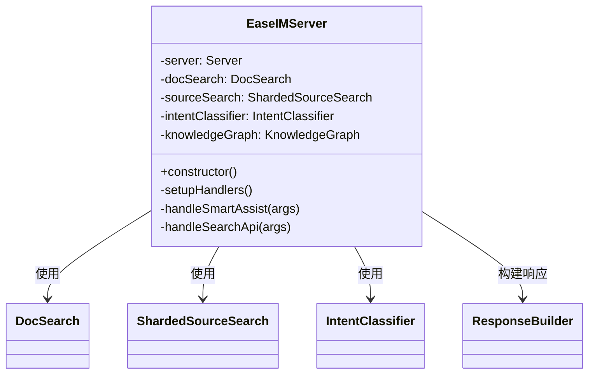
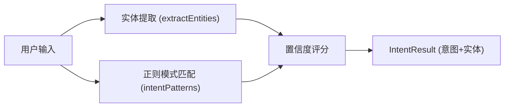
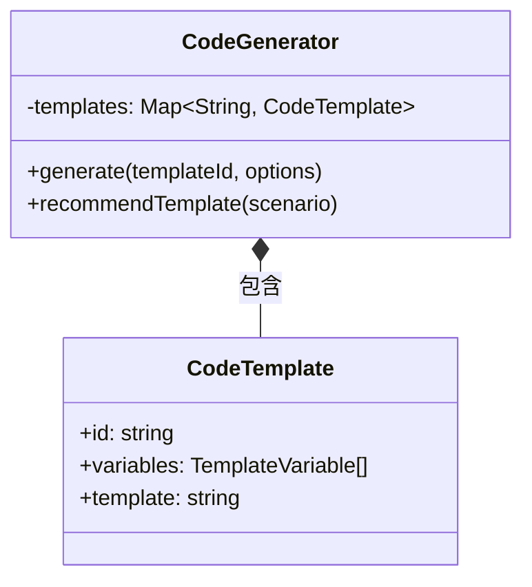
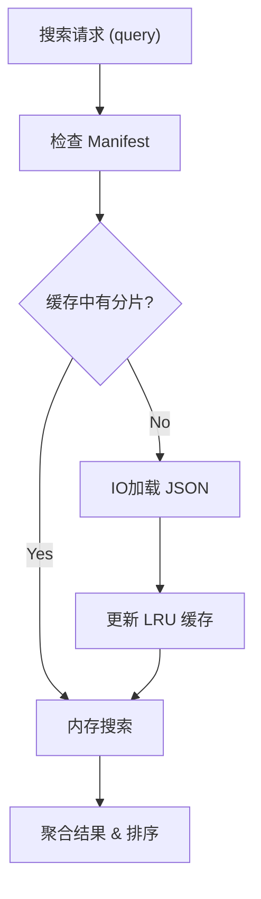
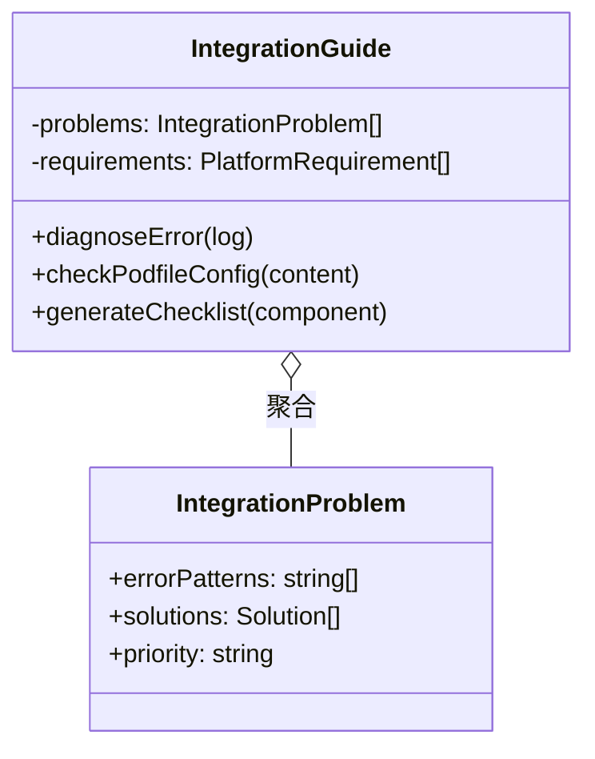
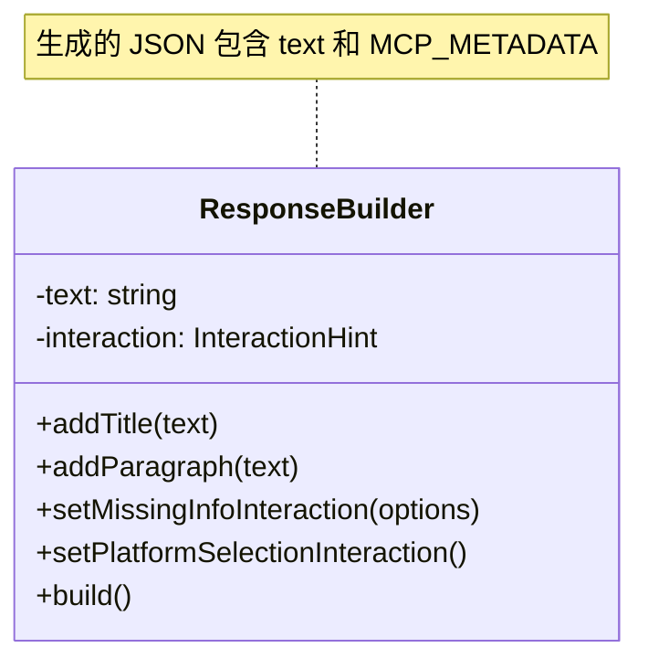

# 代码结构与核心类设计详解

本文档深入解析 `easeim-mcp-server` 的核心 TypeScript 类设计、功能职责以及模块间的交互逻辑。

---

## 1. 核心服务层 (Core Server Layer)

`EaseIMServer` 是整个系统的入口和协调者，采用 **Facade (外观模式)** 设计，对 MCP Client 隐藏了复杂的子系统交互。

### `EaseIMServer` (src/server.ts)

*   **功能描述**: 
    *   初始化 MCP Server 实例。
    *   注册所有 Tool (工具) 的 Schema 和 Handler。
    *   路由分发：将请求分发给 `DocSearch`, `SourceSearch` 或 `IntentClassifier` 等模块。
    *   错误统一处理与日志记录。
*   **设计模式**: Facade, Singleton (逻辑上)

---

## 2. 智能化层 (Intelligence Layer)

这是系统的“大脑”，负责理解自然语言、纠正错误并生成代码。

### `IntentClassifier` (src/intelligence/IntentClassifier.ts)

*   **功能描述**: 
    *   **意图识别**: 基于正则模式 (`RegExp`) 和权重评分 (`Weight`)，将用户输入分类为 `FIX_ERROR`, `CUSTOMIZE_UI` 等 10 种意图。
    *   **实体提取**: 从查询中提取错误码、类名、组件名等关键信息。
    *   **多信号融合**: 结合规则匹配和语义关键词兜底。
*   **关键逻辑**: 优先级队列匹配 (Priority Matching)。

### `SpellCorrector` (src/intelligence/SpellCorrector.ts)

*   **功能描述**: 
    *   **拼写纠错**: 纠正用户输入的 API 或类名拼写错误 (如 `mesage` -> `message`)。
    *   **领域词典**: 维护了一份包含 SDK 术语的词典。
    *   **算法**: Levenshtein Distance (编辑距离)。
*   **设计**: 预加载高频词汇，运行时动态计算距离。

### `ContextManager` (src/intelligence/ContextManager.ts)

*   **功能描述**: 
    *   **会话管理**: 维护多轮对话的上下文状态 (Session State)。
    *   **连续性检测**: 识别 "它怎么用" 中的 "它" 指代的是上一轮的哪个类或 API。
    *   **查询增强**: 将短查询重写为包含上下文的完整查询。

### `KnowledgeGraph` (src/intelligence/KnowledgeGraph.ts)

*   **功能描述**: 
    *   **关系映射**: 存储 "场景" <-> "类" <-> "API" 的图谱关系。
    *   **场景推荐**: 根据关键词推荐最佳开发实践 (Scenario)。
*   **数据结构**: `Map<ScenarioID, Solution>`。

### `CodeGenerator` (src/intelligence/CodeGenerator.ts)

*   **功能描述**: 
    *   **模板引擎**: 基于预定义的字符串模板生成代码。
    *   **动态填充**: 将用户提供的变量 (如 `messageName`) 注入模板。
    *   **多语言支持**: 支持生成 Swift (iOS) 和 Kotlin (Android) 代码。

---

## 3. 搜索引擎层 (Search Engine Layer)

这是系统的“眼睛”，负责从海量数据中快速检索信息。

### `DocSearch` (src/search/DocSearch.ts)

*   **功能描述**: 
    *   **文档检索**: 针对 Markdown 文档的全文检索。
    *   **算法**: **BM25** (Best Matching 25) 概率检索框架。
    *   **结构化数据**: 依赖 `data/docs/index.json`。
*   **特性**: 支持按 `platform` (iOS/Android) 过滤结果。

### `ShardedSourceSearch` (src/search/ShardedSourceSearch.ts)

*   **功能描述**: 
    *   **分片管理**: 管理大规模源码索引的分片加载。
    *   **性能优化**: 实现 **LRU Cache** (最近最少使用) 策略，内存中只保留最常用的索引分片。
    *   **并行搜索**: 同时在多个分片中执行搜索并聚合结果。
*   **设计模式**: Proxy / Lazy Loading。

### `ConfigSearch` (src/search/ConfigSearch.ts)

*   **功能描述**: 
    *   **配置检索**: 专门检索 `Appearance` (iOS) 和 `Config` (Android) 类中的属性。
    *   **影响分析**: 能够反向查询某个配置项被哪些 UI 组件使用 (`ConfigUsage`)。

---

## 4. 诊断与工具层 (Diagnostic & Utils)

### `IntegrationGuide` (src/intelligence/IntegrationGuide.ts)

*   **功能描述**: 
    *   **规则引擎**: 存储了一套集成问题的诊断规则 (`INTEGRATION_PROBLEMS`)。
    *   **日志分析**: 将用户提供的报错日志与规则库匹配，计算相似度得分。
    *   **Podfile 检查**: 解析 Podfile 文本，校验版本号和必要配置。

### `ResponseBuilder` (src/utils/ResponseBuilder.ts)

*   **功能描述**: 
    *   **响应构建**: 采用 **Builder 模式** 链式构建 MCP 响应。
    *   **交互引导**: 封装了 `missing_info` (缺槽位)、`ambiguous` (歧义) 等交互类型的元数据构造。
    *   **平台检测**: `detectMissingPlatform` 静态方法用于分析查询是否缺失平台信息。

---

## 5. 数据层 (Data Layer)

系统完全依赖本地 JSON 文件作为数据源，无需外部数据库。

*   **Docs Index**: `data/docs/index.json` - 包含文档元数据、内容摘要和 API 列表。
*   **Config Index**: `data/configs/index.json` - 包含所有可配置项及其默认值。
*   **Source Index**: `data/sources/` - 分片存储的源码符号表（Class/Method/Property）。

---

## 总结

`easeim-mcp-server` 的代码设计遵循 **"重检索、轻生成"** 的原则：

1.  **高内聚**: 搜索逻辑、智能逻辑、诊断逻辑分离。
2.  **高性能**: 通过 `ShardedSourceSearch` 和 `IntentClassifier` 的正则优化，确保在 Node.js 单线程下也能毫秒级响应。
3.  **可扩展**: 通过 `KnowledgeGraph` 和 `IntegrationGuide` 的配置化设计，新增知识点无需修改核心代码。
