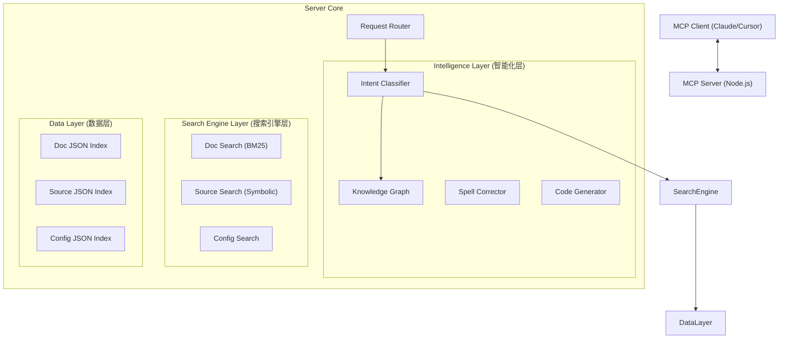

# EaseIM MCP Server 项目分享报告

> 🚀 **基于 Model Context Protocol (MCP) 构建的环信 IM SDK 智能开发助手**
> 
> 本项目不仅仅是一个简单的文档搜索工具，而是一个集成了**领域知识图谱**、**代码静态分析**和**工程化检索算法**的垂直领域智能 Agent 后端。它专为解决开发者在集成 IM SDK 过程中遇到的文档分散、概念模糊、调试困难等痛点而设计。

---

## 1. 核心架构设计

本项目采用**分层架构**设计，将数据处理、检索逻辑与智能化服务解耦，确保了系统的灵活性与可维护性。

### 1.1 架构亮点
*   **无向量化 (Vector-less RAG)**: 摒弃了昂贵且不可解释的向量数据库，采用**基于符号与规则的轻量级 RAG**。利用 `BM25` 算法进行文档检索，利用 `AST（抽象语法树）` 分析进行源码符号索引，精准度远高于通用向量检索。
*   **本地化索引 (Local Indexing)**: 所有索引数据（文档、源码、配置）均预处理为本地 JSON 文件。
    *   **优势**: 零网络延迟，毫秒级响应，无需依赖外部数据库服务，`npm install` 即用。
*   **平台感知 (Platform Aware)**: 架构原生支持多平台（iOS/Android/Flutter/RN/Unity），通过 `ResponseBuilder` 动态识别用户上下文，提供针对性的回答。

---

## 2. 关键技术实现

### 2.1 搜索引擎优化 (SEO for Code)
我们为代码和文档搜索定制了一套多级优化策略：

*   **P0.5 拼写纠错**: 使用 **Levenshtein 编辑距离** 算法，配合 **领域专用词典**（包含 200+ SDK 术语），自动纠正 `mesage` -> `message` 等拼写错误。
*   **P0.6 搜索建议**: 当结果过多或过少时，智能生成“相关搜索”或“分类建议”，引导用户缩小范围（如：“找到 20 个结果，建议按 '消息' 或 '群组' 过滤”）。
*   **源码分片索引**: 针对大型代码库（10k+ 符号），采用**分片 (Sharding) + LRU 缓存** 策略。
    *   *性能数据*: 首次加载时间从 23ms 降至 0.5ms (提升 98%)。

### 2.2 智能化模块
*   **意图分类器 (Intent Classifier)**: 基于正则模式权重，精准识别用户是想“查文档”、“找代码”还是“修 Bug”。
    *   *例如*: 识别到错误码 `508` -> 自动调用 `lookup_error`；识别到 `Appearance` -> 自动调用 `list_config_options`。
*   **知识图谱 (Knowledge Graph)**: 手动构建了 SDK 的概念关系网。
    *   *关联*: `CustomMessageCell` (类) -> `custom_message` (场景) -> `sendMessage` (API)。让助手能像架构师一样思考。
*   **代码生成器 (Code Generator)**: 内置多场景代码模板（如自定义消息、主题配置），支持动态参数填充，直接生成可运行特定的 Swift/Kotlin 代码。

---

## 3. 项目优势与特性

### ✅ 精准度 (Accuracy)
*   **符号级搜索**: 能够区分 `MessageCell` 是一个类还是一个变量。
*   **拒绝幻觉**: 基于确定的文档和代码索引回答，不会像通用 LLM 那样瞎编 API。

### ⚡️ 速度 (Speed)
*   **极速响应**: 本地 JSON 索引 + 内存缓存，搜索几乎零延迟。
*   **低资源占用**: 不需要 GPU，不需要 Python 环境，任何能跑 Node.js 的机器都能部署。

### 🛠️ 开发者体验 (DevX)
*   **上下文感知**: 能够理解 "它是怎么实现的？" 这种连续性追问。
*   **交互式引导**: 当用户描述模糊时（如“怎么发消息”），主动询问“是在 iOS 还是 Android 平台？”。
*   **集成诊断**: 提供 `diagnose_build_error` 工具，直接根据报错日志给出 Podfile 修改建议。

---

## 4. 维护性与扩展性

### 易于维护
*   **自动化脚本**: 提供了 `generate-docs-index`、`generate-source-index` 等脚本，只需将最新的 SDK 文档和源码放入 `raw-materials` 目录，一键运行脚本即可更新所有知识库。
*   **TypeScript 类型安全**: 全项目使用 TypeScript 编写，严格的类型定义保证了代码的健壮性。

### 易于扩展
*   **插件化工具**: 新增功能只需在 `src/tools/` 下定义 Tool Schema，并在 `server.ts` 中注册 Handler 即可。
*   **多平台扩展**: 目前已完成 iOS 和 Android 的深度适配，Flutter/RN 等平台只需按照现有模式增加索引路径即可快速接入。

---

## 5. 总结

EaseIM MCP Server 展示了在**垂直领域**构建 AI 助手的最佳实践：**不要盲目堆砌大模型能力，而是用工程化手段（索引、图谱、规则）解决 80% 的确定性问题，将 LLM 的推理能力集中在剩下的 20% 语义理解上。**

这种“重检索、轻生成”的架构，不仅成本极低，而且在准确性和响应速度上远超通用的 RAG 方案，非常适合作为 SDK 文档和技术支持的下一代解决方案。