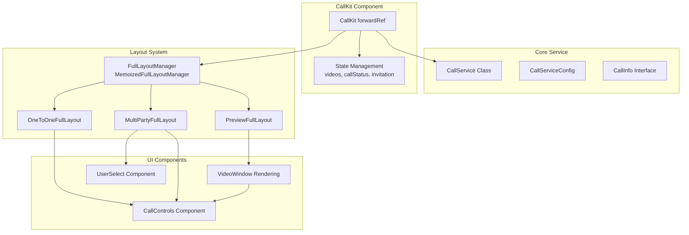
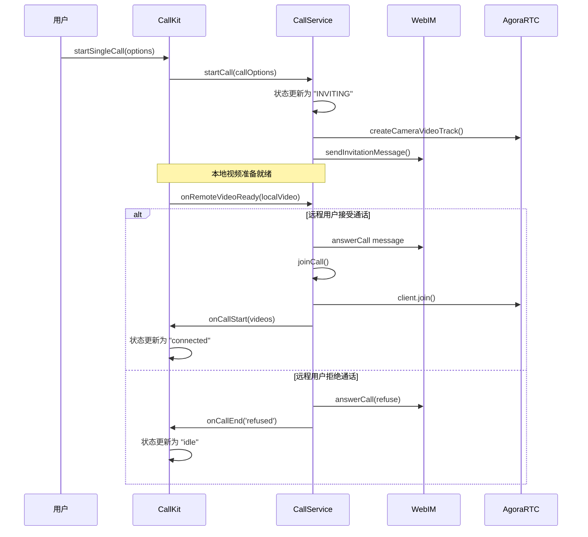
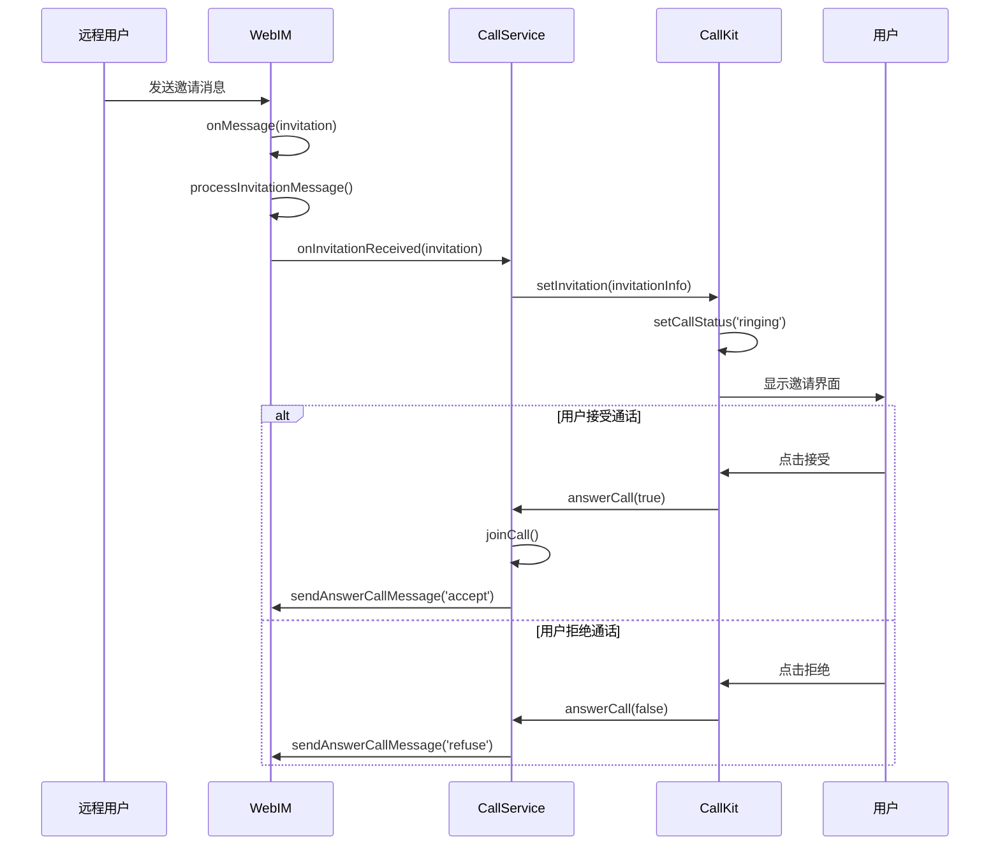

# CallKit 架构文档

## 概述

CallKit 是一个功能完整的音视频通话组件库，支持一对一通话、群组通话等多种场景。该组件采用模块化设计，提供了灵活的布局系统、完整的通话状态管理和丰富的用户交互功能。

## 项目结构

```
module/callkit/
├── CallKit.tsx                 # 主组件，核心逻辑入口
├── components/                 # UI组件目录
│   ├── VideoPlayer.tsx        # 视频播放器组件
│   ├── InvitationContent.tsx  # 邀请内容组件
│   └── ...
├── layouts/                    # 布局系统目录
│   ├── FullLayoutManager.tsx  # 完整布局管理器
│   ├── OneToOneFullLayout.tsx # 一对一通话布局
│   ├── MultiPartyFullLayout.tsx # 多人通话布局
│   └── PreviewFullLayout.tsx  # 预览模式布局
├── services/                   # 服务层目录
│   ├── CallService.ts         # 通话服务核心类
│   ├── CallError.ts           # 错误处理类
│   └── ...
├── hooks/                      # 自定义Hook目录
│   ├── useCallTimer.ts        # 通话计时器Hook
│   ├── useInvitationTimers.ts # 邀请定时器Hook
│   ├── useContainerSize.ts    # 容器尺寸Hook
│   ├── useFullscreen.ts       # 全屏控制Hook
│   ├── useResizable.ts        # 尺寸调整Hook
│   └── useDraggable.ts        # 拖拽控制Hook
├── types/                      # 类型定义目录
│   ├── index.ts               # 主要类型定义
│   ├── layout.ts              # 布局相关类型
│   └── ...
└── styles/                     # 样式文件目录
    └── index.scss             # 主样式文件
```

## 核心架构组件

### 1. 核心服务层 (Core Service)

**CallService Class**

- 负责管理通话的核心逻辑
- 处理音视频流的创建、管理和销毁
- 管理通话状态转换
- 与 WebIM 和 AgoraRTC 进行交互

**CallServiceConfig**

- 配置 CallService 的各种参数
- 包含回调函数、连接信息等配置项

**CallInfo Interface**

- 定义通话信息的标准格式
- 包含通话 ID、类型、参与者等关键信息

### 2. CallKit 组件层 (CallKit Component)

**CallKit forwardRef**

- 主要的 React 组件入口
- 管理组件的整体状态和生命周期
- 提供对外的方法接口

**状态管理 (State Management)**

- `videos`: 管理所有视频窗口信息
- `callStatus`: 管理通话状态
- `invitation`: 管理邀请相关信息

### 3. 布局系统 (Layout System)

**FullLayoutManager / MemoizedFullLayoutManager**

- 统一的布局管理器，支持多种布局模式
- 使用 React.memo 进行性能优化
- 根据通话类型自动选择合适的布局

**布局类型**

- `OneToOneFullLayout`: 一对一通话布局
- `MultiPartyFullLayout`: 多人通话布局
- `PreviewFullLayout`: 预览模式布局

### 4. UI 组件层 (UI Components)

**CallControls Component**

- 通话控制按钮（静音、摄像头、扬声器等）
- 支持自定义图标和样式

**VideoWindow Rendering**

- 视频窗口渲染组件
- 支持本地和远程视频流
- 包含用户头像、昵称、状态指示器等

**UserSelect Component**

- 用户选择组件，用于群组通话
- 支持多选和搜索功能

## 组件关系图



## 呼出通话流程图



## 接听通话流程图



## 主要功能特性

### 1. 通话类型支持

- **一对一视频通话**: 支持本地预览、远程视频显示
- **一对一音频通话**: 纯音频通话模式
- **群组通话**: 支持多人音视频通话

### 2. 布局系统

- **自适应布局**: 根据参与者数量自动调整布局
- **多种布局模式**: 支持一对一、多人、预览等不同布局
- **响应式设计**: 支持窗口大小调整和拖拽

### 3. 状态管理

- **完整的状态机**: idle → calling → ringing → connected
- **实时状态同步**: 与 CallService 保持状态一致
- **错误处理**: 完善的错误处理和恢复机制

### 4. 用户交互

- **控制按钮**: 静音、摄像头、扬声器等
- **拖拽和调整**: 支持窗口拖拽和尺寸调整
- **全屏和最小化**: 支持全屏模式和最小化功能

### 5. 通知系统

- **邀请通知**: 支持自定义邀请内容和样式
- **超时处理**: 自动处理邀请超时
- **多语言支持**: 内置国际化支持

## 技术架构特点

### 1. 模块化设计

- 清晰的职责分离
- 可复用的组件和 Hook
- 易于扩展和维护

### 2. 性能优化

- 使用 React.memo 减少不必要的重渲染
- 合理的状态管理和更新策略
- 视频流的优化处理

### 3. 类型安全

- 完整的 TypeScript 类型定义
- 接口约束和类型检查
- 开发时的智能提示

### 4. 可配置性

- 丰富的配置选项
- 支持自定义样式和图标
- 灵活的回调函数系统

## 总结

CallKit 是一个设计完善、功能丰富的音视频通话组件库。通过清晰的架构分层、完善的类型定义和灵活的配置选项，为开发者提供了强大而易于使用的通话功能。其模块化设计使得组件具有良好的可维护性和扩展性，能够满足各种复杂的通话场景需求。
